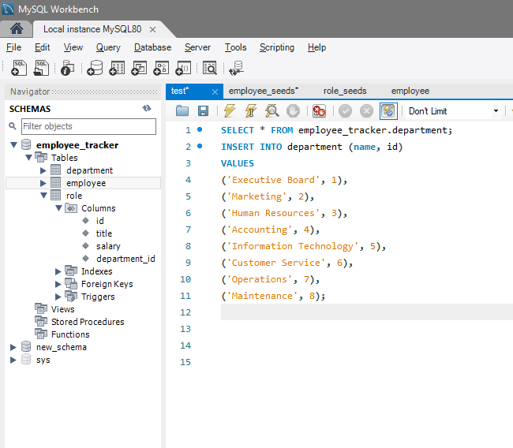
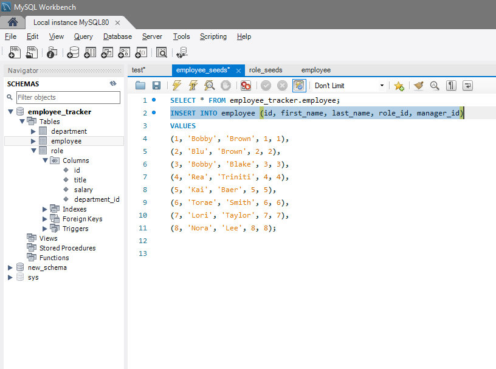
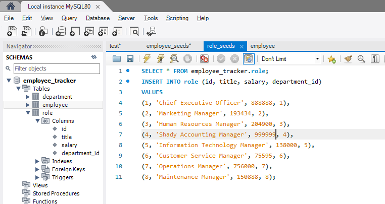
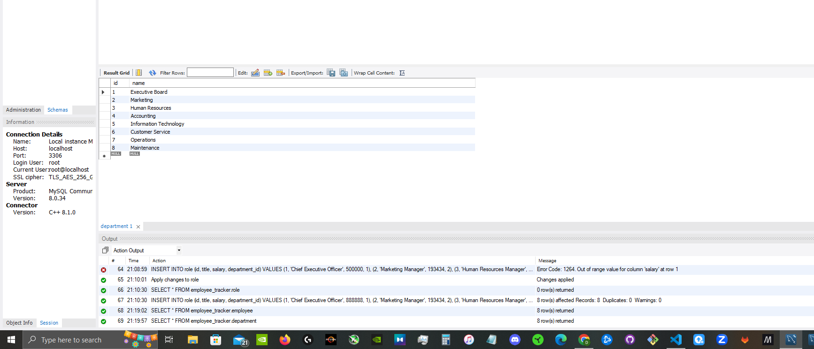
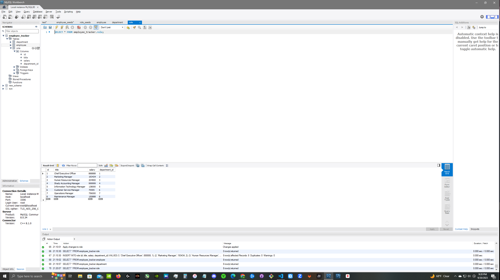

# Employee Tracker Database 


# Description
This challenge is to build a Content Management Systems (CMS) application from scratch to manage a company's employee database, using Node.js, Inquirer, and MySQL.

## Table of Contents
* [Installation](#installation)
* [Functionalities](#functionalities)
* [Usage](#usage)
* [License](#license)
* [Contributing](#contributing)
* [Tests](#tests)
* [Questions](#questions)

## Installation
* [MySQL Workbench](https://www.mysql.com/products/workbench/)

### The following dependencies required to run the application:
* [MySQL2](https://www.npmjs.com/package/mysql2)

* [Inquirer.js](https://www.npmjs.com/package/inquirer/v/8.2.4)

* [NodeJS](https://nodejs.org/en/download)

* [Nodemon](https://www.npmjs.com/package/nodemon)


## Functionalities
### A user can do the following things with this Note Taking App:
* Display Departments

* Display Employees by ID, Salary, Department and Manager ID 

* Display roles


## Usage
```bash
node server.js
```


[Demo]https://drive.google.com/file/d/1745QR6F13lWo42XuvGqWtj8pwAH3moX3/view
## License


## Contributing:
UCF Bootcamp Student Support


## Tests
### MySQL syntax to input values into the table







### Run execute to validate table





.png>)


## Questions
This project was created by Kevin Rice; for additional questions, reach out to me at the following below:
* Author: [Kevin Rice](https://app.slack.com/client/T056YAJ4MPF/D05D0V54751)
* GitHub: [DirtyRice901](https://github.com/DirtyRice901/)
* Email: reatriniti@gmail.com 

---
© 2023 edX Boot Camps LLC. Confidential and Proprietary. All Rights Reserved.
